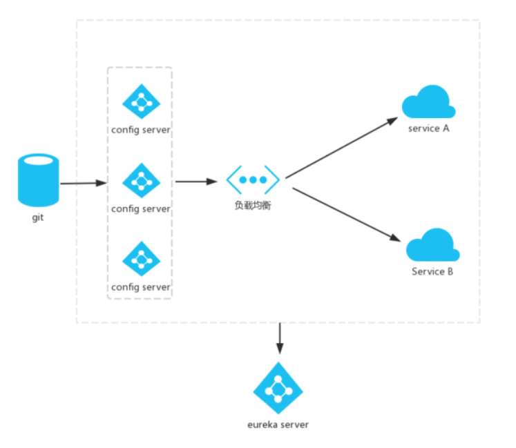

# Config-Server
服务配置中心 

## 创建服务配置中心
1.配置pom.xml

    <dependency>
        <groupId>org.springframework.boot</groupId>
        <artifactId>spring-boot-starter-web</artifactId>
    </dependency>
    <dependency>
        <groupId>org.springframework.cloud</groupId>
        <artifactId>spring-cloud-config-server</artifactId>
    </dependency>
2.启动添加注解 **@EnableConfigServer**开启配置服务器功能

    @SpringBootApplication
    @EnableConfigServer 
    public class ConfigServerApplication {
        public static void main(String[] args) {
            SpringApplication.run(ConfigServerApplication.class, args);
        }
    }
3.配置application.yml,定义其他服务的配置路径,如下为git示例，配置中心支持svn、数据库、本地文件、git等

    server:
      port: 8040
    
    spring:
      application:
        name: config
      cloud:
        config:
          server:
            git:
              uri: https://github.com/pemila/SpringCloud/ #git仓库地址
              search-paths: configfiles #仓库配置路径
              username:                 #访问用户名
              password:                 #访问密码
          label: master                 #配置仓库的分支
4.github定义配置文件，用于测试内容读取

    configfiles/config-client-dev.properties
    
    test = test version 2
    democonfigclient.message=hello spring io
    
5.访问http://localhost:8040/test/dev,结果如下,

    {
        "name": "test",
        "profiles": [
            "dev"
        ],
        "label": null,
        "version": "f6081056a279b8c89dde202aab5df94ea1d813c5",
        "state": null,
        "propertySources": []
    }
   
   http请求地址和资源文件映射如下:    
   - /{application}/{profile}[/{label}]
   - /{application}-{profile}.yml
   - /{label}/{application}-{profile}.yml
   - /{application}-{profile}.properties
   - /{label}/{application}-{profile}.properties

6.创建在配置中心配置的客户端(其他所有应用均继承客户端应用)
    [Congfig-client](/congfig-client/Readme.md)
    
## 配置中心微服务化

#### config-server修改
1.pom.xml添加eureka-client依赖

    <dependency>
        <groupId>org.springframework.cloud</groupId>
        <artifactId>spring-cloud-starter-netflix-eureka-client</artifactId>
    </dependency>
2.配置application.yml添加注册中心地址

    eureka:
      client:
        serviceUrl:
          defaultZone: http://localhost:8000/eureka/
3.启动类添加 **@EnableEureka**注解

    @SpringBootApplication
    @EnableConfigServer
    @EnableEurekaClient
    public class ConfigServerApplication {
    
        public static void main(String[] args) {
            SpringApplication.run(ConfigServerApplication.class, args);
        }
    }
#### config-client修改

   [Congfig-client](/congfig-client/Readme.md)/微服务化