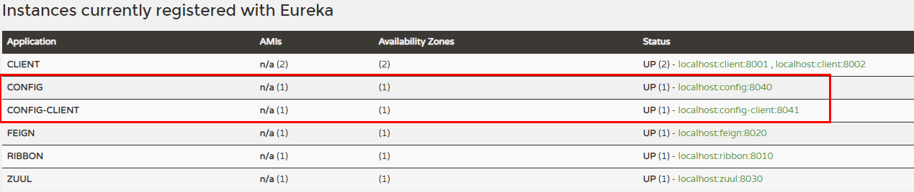

# Config-client
使用配置中心的客户端应用

## 创建client
1.配置pom.xml

    <dependencies>
        <dependency>
            <groupId>org.springframework.boot</groupId>
            <artifactId>spring-boot-starter-web</artifactId>
        </dependency>
        <dependency>
            <groupId>org.springframework.cloud</groupId>
            <artifactId>spring-cloud-starter-config</artifactId>
        </dependency>
    </dependencies>
2.创建配置文件bootstrap.yml
    
    spring:
      application:
        name: config-client
      cloud:
        config:
          label: master #指定远程仓库分支
          profile: dev  #开发环境配置 test=测试环境 pro=生产环境
          uri: http://127.0.0.1:8040/ #声明配置服务中心config-server的网址
    server:
      port: 8041
3.程序入口类 获取配置

    @SpringBootApplication
    @RestController
    public class CongfigClientApplication {
    
        public static void main(String[] args) {
            SpringApplication.run(CongfigClientApplication.class, args);
        }
    
        @Value("${foo}")
        String foo;
        @RequestMapping(value = "/hi")
        public String hi(){
            return foo;
        }
    }
4.访问如下网址：
    
    http://127.0.0.1:8041/hi
    
返回结果如下：

    test version 2
说明如下问题：

- config-client从config-server获取了foo的属性，
- config-server从git仓库读取了foo

## 微服务化
1.pom.xml添加eureka-client依赖

    <dependency>
        <groupId>org.springframework.cloud</groupId>
        <artifactId>spring-cloud-starter-netflix-eureka-client</artifactId>
    </dependency>
2.配置文件bootstrap.yml添加注册中心配置,此时调用配置中心不再通过IP而是通过服务名

    eureka:
      client:
        serviceUrl:
          defaultZone: http://localhost:8000/eureka/
    spring:
      application:
        name: config-client
      cloud:
        config:
          label: master #指定远程仓库分支
          profile: dev  #开发环境配置 test=测试环境 pro=生产环境
          #uri: http://127.0.0.1:8040/ #声明配置服务中心config-server的网址
          discovery:
            enabled: true       # 是否从配置中心读取文件 true=是
            service-id: config  #配置中心的serviceId 即配置中心在服务注册中心注册的服务名
3.启动类添加 **@EnableEureka**注解

    @SpringBootApplication
    @RestController
    @EnableEurekaClient
    public class CongfigClientApplication {
    
        public static void main(String[] args) {
            SpringApplication.run(CongfigClientApplication.class, args);
        }
    
        @Value("${test}")
        String foo;
        @RequestMapping(value = "/hi")
        public String hi(){
            return foo;
        }
    }
4.查看注册中心

